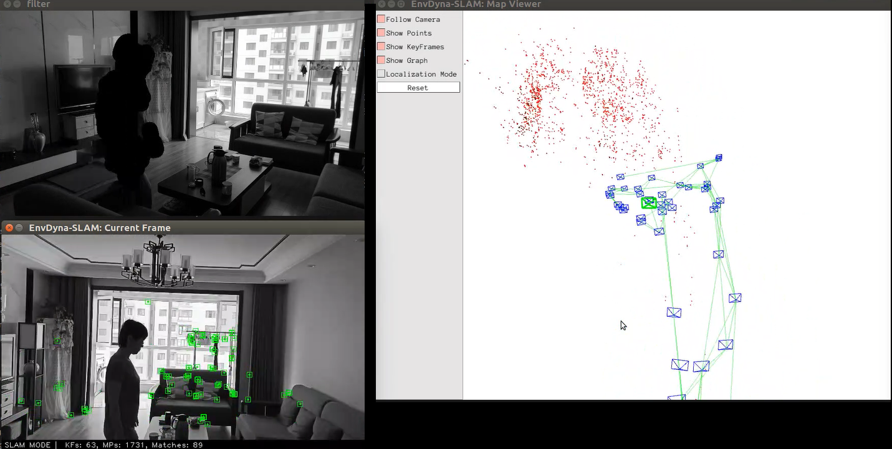
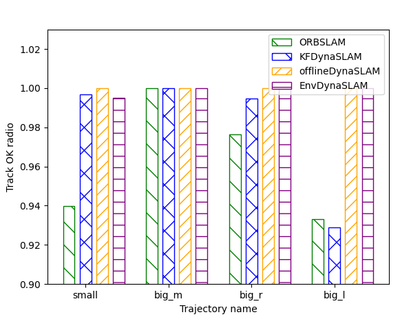

# EnvDynaSLAM

EnvDynaSLAM is a mono SLAM system that is designed to solve the problem of dynamic points culling in SLAM.
I use a *environment static camera to help cull the dynamic points* and the system get better accuracy in dynamic conditions and *run very faster* than dynamic SLAM based on Deep Learning. The basic system is ORBSLAM.

So it's called **EnvDynaSLAM**.

This is a part of the code of my undergraduate project in Shanghai Jiaotong University,"Improvement of Indoor Positioning Technology Based on SLAM--Research on the Problem of Dynamic Point Culling" . 

**The other part is dedicated to the using MaskRCNN to help with dynamic point removal and only KF segment to speed up,called [KFDynaSLAM](https://github.com/mingsjtu/ORB-SLAM_MaskRCNN_KeyFrame)**. If there is any error, please pull issues or contact mingsjtu@163.com
The graduation design of this job is rated A+.
For the convenience of readers’ understanding, the English abstract of the graduation design thesis is attached for reference (due to the school's graduation thesis handling regulations, the original text cannot be released temporarily, please understand)
If it helps, please quote in the following format, thank you.

郭铭.基于 SLAM 的室内定位技术改进[D].上海：上海交通大学电子信息与电气工程学院，2020.

EnvDynaSLAM是一个为解决SLAM中的动态点去除问题而做的单目SLAM系统。我选用一个环境中摄像头以辅助动态点的去除。实验结果表明，该系统相比ORBSLAM会带来精度的提升，相比基于深度学习的动态SLAM运行的非常快。基础系统是ORBSLAM。

因此，我称他为**EnvDynaSLAM**。

这是我在上海交通大学做的本科毕设项目《基于SLAM的室内定位技术改进--对环境中动态点去除问题的研究》的代码的一部分，另一部分致力于通过Mask RCNN进行动态点去除并通过只分割关键帧进行了加速，**[KFDynaSLAM](https://github.com/mingsjtu/ORB-SLAM_MaskRCNN_KeyFrame)**。如有错误，欢迎 pull issues 或者联系mingsjtu@163.com**
这项工作毕业设计总评为A+。


为方便读者理解，附毕业设计论文的英文大摘要以供参考（由于校毕业论文办理规章所限，暂无法公开原文，请谅解）
如有帮助，请按照以下格式引用，谢谢。

郭铭.基于 SLAM 的室内定位技术改进[D].上海：上海交通大学电子信息与电气工程学院，2020.


Below is a demo screen shot when the EnvDynaSLAM is trying to processing a video taken in my house.

*Figure 1: Demo*




We provide examples to run the SLAM system using videos of your own as monocular, for the project is to research the SLAM use of indoor location and you need both a target camera (move) and an environment camera (static). So I only use my own video.


## Getting Started
1. Prepare ORB-SLAM
	- Install ORB-SLAM2 prerequisites: C++11 or C++0x Compiler, Pangolin, OpenCV and Eigen3  (https://github.com/raulmur/ORB_SLAM2).

2. Build and RUN
Clone this repo:
```bash
git clone https://github.com/mingsjtu/EnvDynaSLAM
cd EnvDynaSLAM
```
Change some path in [CMakeLists.txt](CMakeLists.txt) if needed
Build the project
```
cd EnvDynaSLAM
chmod +x build.sh
./build.sh
```

## Prepare Data
I provide `prepare_data` folder which contains python files to help you prepare data with your own video.
1. Convert the videos to picture sequence

Both moving camera's video and environment camera's video need to be converted

Change the file path and start time in [video2pic.py](prepare_data/video2pic.py)


``` python
video_name="/media/gm/Data/SLAM/self_video/5.16morn/huawei_20200516_081324"# mp4file path without '.mp4
video_to_image(video_name+".mp4",video_name+"/rgb",8*3600+11*60+50)# start time hour*3600+minute*60+second
generate_rgbtxt(video_name+"/rgb",video_name+"/rgb.txt")

```

run
``` bash
cd prepare_data
python video2pic.py
```

You will get a sequnence of pictures and a TXT containing pictures name and timestamps.

2. Connect moving sequence to environment sequence

Change the file path and start time in [move_env.py](prepare_data/move_env.py)


``` python
move_dir="/media/gm/Data/SLAM/self_video/5.16morn/xiaomi_20200516_081150"
env_dir="/media/gm/Data/SLAM/self_video/5.16morn/huawei_20200516_081324"

```

run
``` bash
cd prepare_data
python move_env.py
```

You will get a TXT containing moving pictures' names and their associated environment pictures' names and timestamps.
 

## Monocular Example on Your own Dataset

- Execute the following command. Change `TUMX.yaml` to your moving camera's parameters. Change `PATH_TO_SEQUENCE_FOLDER` to the uncompressed moveing camera sequence folder. Change `PATH_TO_ENV_SEQUENCE_FOLDER` to the uncompressed static environment camera sequence folder.

``` bash
./Examples/Monocular/mono_my Vocabulary/ORBvoc.txt Examples/Monocular/TUMX.yaml PATH_TO_SEQUENCE_FOLDER PATH_TO_ENV_SEQUENCE_FOLDER
```

# Test result
## Success Rate
I use EnvDynaSLAM and [KFDynaSLAM](https://github.com/mingsjtu/ORB-SLAM_MaskRCNN_KeyFrame) and offlineSLAM(put done mask in `PATH_TO_MASKS` before run SLAM) and ORBSLAM using 4 different videos taken by my phone. The result is as below. 

*Figure 2: Tracking OK rate*





It shows the EnvDynaSLAM has better accuracy than ORBSLAM, and offlineSLAM is the best.

## Time
I use KFDynaSLAM and offlineSLAM(put done mask in `PATH_TO_MASKS` before run SLAM) and EnvDynaSLAM and ORBSLAM using TUM dynamic dataset. The result is as below.

*Figure 4: Time test result*


It shows the segment part is very time-costing.

You can find EnvDynaSLAM can cull dynamic points with very short time. It is much faster than KFDynaSLAM.


## Acknowledgements
Thanks to [ORB-SLAM2](https://github.com/raulmur/ORB_SLAM2) that give a lot of help to my project.

